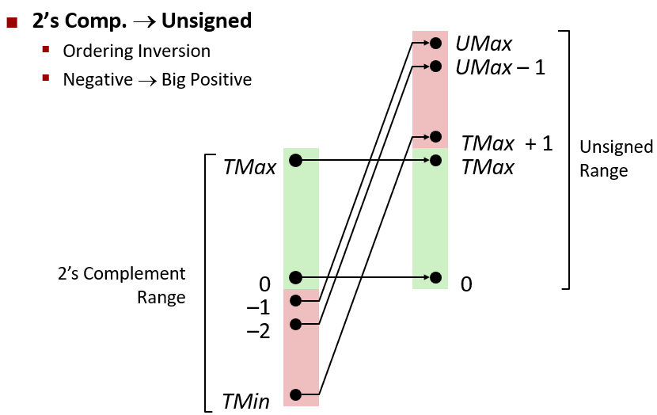

# 2.1 信息存储

## 虚拟内存：

1. 大多数计算机使用 8 位的块，或者字节(Byte)，作为最小的可寻址的内存单元，而不是访问内存中单独的位。机器级程序将内存视为一个非常大的字节数组，称为虚拟内存(virtual address space)。

2. 内存的每个字节都有一个唯一的地址，所有可能地址的集合就称为虚拟地址空间。

## 2.1.2 字数据大小
### unsigned 和 signed 之间的相互转换

**unsigned 和 signed 建议不要混用**

### 32位和64位系统中的字节大小差异

因为32位和64位系统，相同的数据类型会存在不同字节大小的差异。  
于是`ISO C99`标准中出现了头文件`stdint.h`引入了`int32_t`和`int64_t`，分别大小为4和8个字节。  
**使用确定大小的整数类型是程序员准确控制数据表示的最佳途径。**   

## 2.1.3 寻址和字节顺序
### 16进制浮点数的表示

相同的数字，用整数存储的和用浮点数存储的十六进制数不一样  
**整数中除了最高有效位1，其他都存在与浮点数中**  

## 移位
<table>
    <tr>
        <td colspan="2">x</td>
        <td colspan="2">x << 3</td>
        <td colspan="2">x >> 2(逻辑的)</td>
        <td colspan="2">x >> 2(算术的)</td>
    </tr>
    <tr>
        <td>十六进制</td>
        <td>二进制</td>
        <td>二进制</td>
        <td>十六进制</td>
        <td>二进制</td>
        <td>十六进制</td>
        <td>二进制</td>
        <td>十六进制</td>
    </tr>
    <tr>
        <td>0xC3</td>
        <td>11000011</td>
        <td>00011000</td>
        <td>0x18</td>
        <td>00110000</td>
        <td>0x30</td>
        <td>11110000</td>
        <td>0xF0</td>
    </tr>
    <tr>
        <td>0x75</td>
        <td>01110101</td>
        <td>10101000</td>
        <td>0xA8</td>
        <td>00011101</td>
        <td>0x1D</td>
        <td>00011101</td>
        <td>0x1D</td>
    </tr>
    <tr>
        <td>0x87</td>
        <td>10000111</td>
        <td>00111000</td>
        <td>0x38</td>
        <td>00100001</td>
        <td>0x21</td>
        <td>11100001</td>
        <td>0xE1</td>
    </tr>
    <tr>
        <td>0x66</td>
        <td>01100110</td>
        <td>00110000</td>
        <td>0x30</td>
        <td>00011001</td>
        <td>0x19</td>
        <td>00011001</td>
        <td>0x19</td>
    </tr>
</table>

# 2.2 整数表示